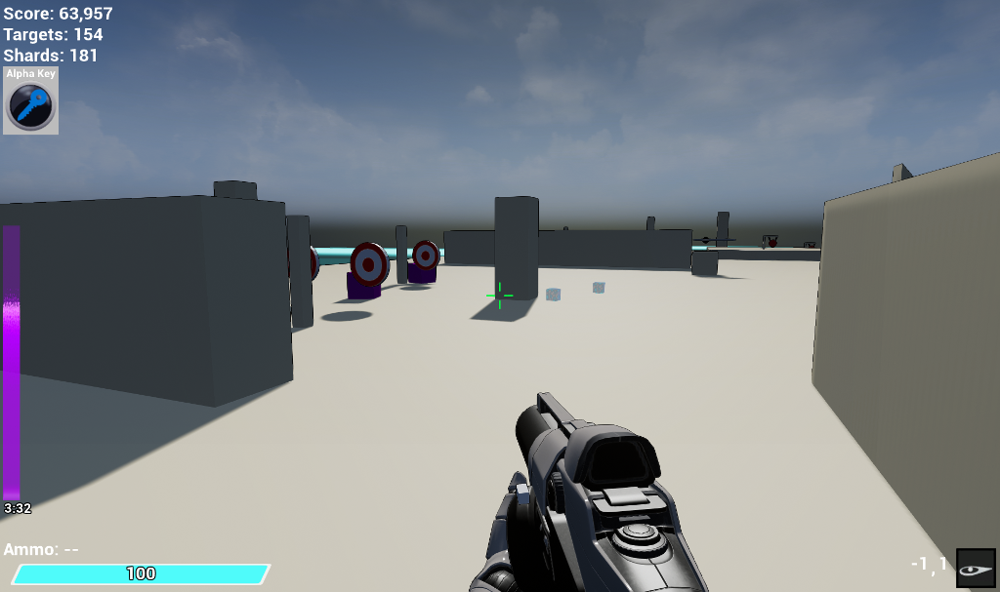
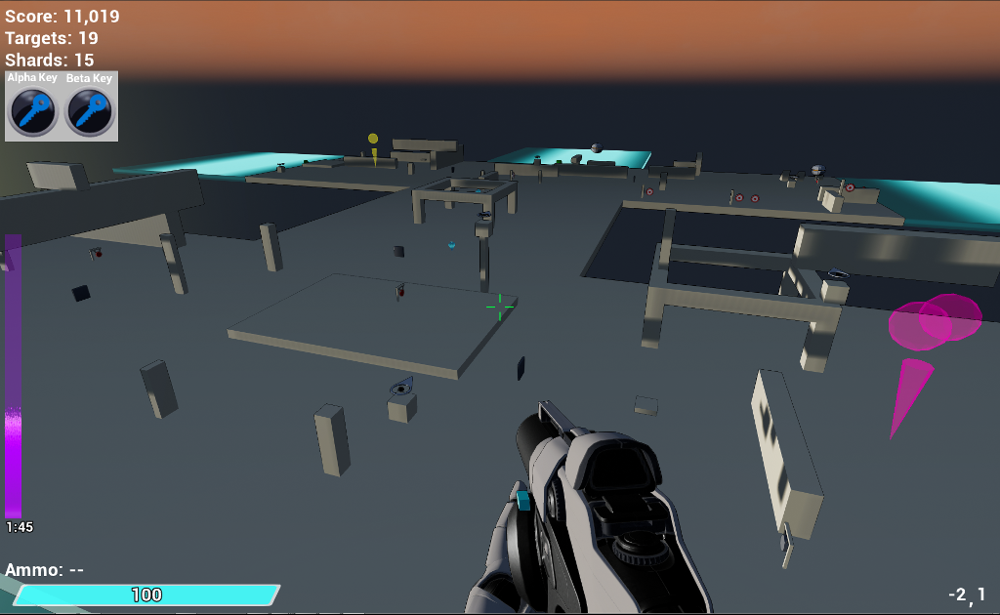
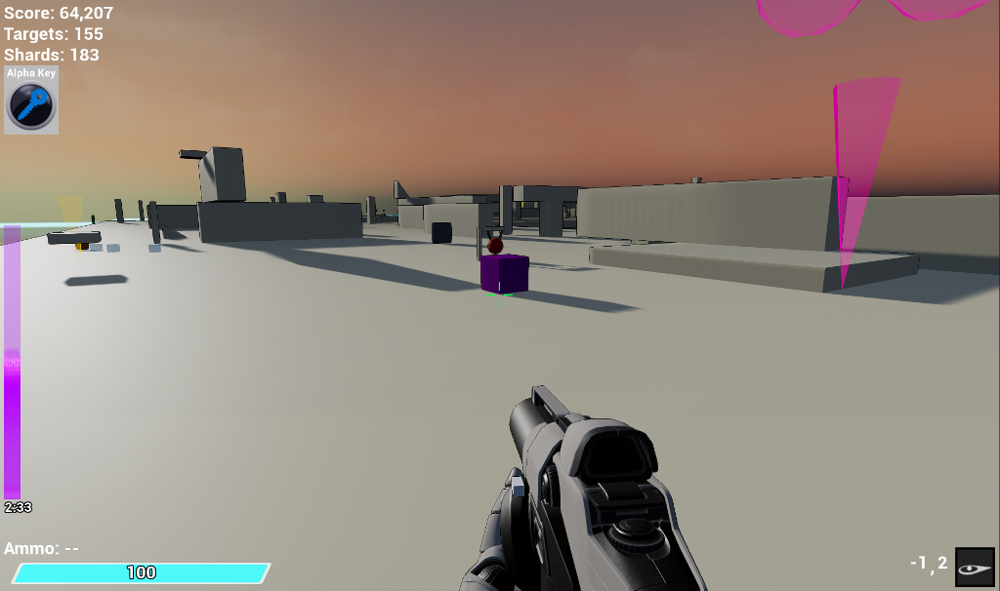
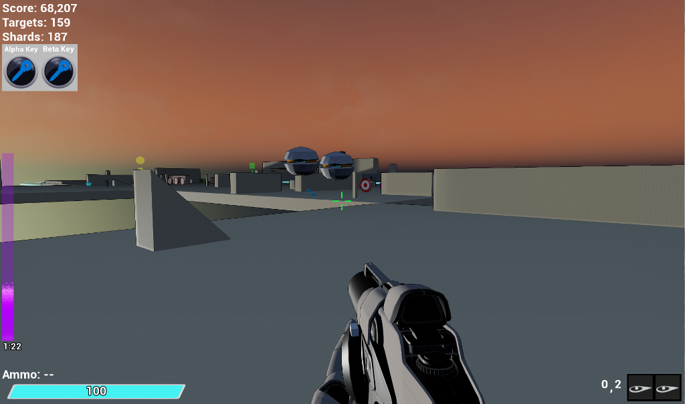
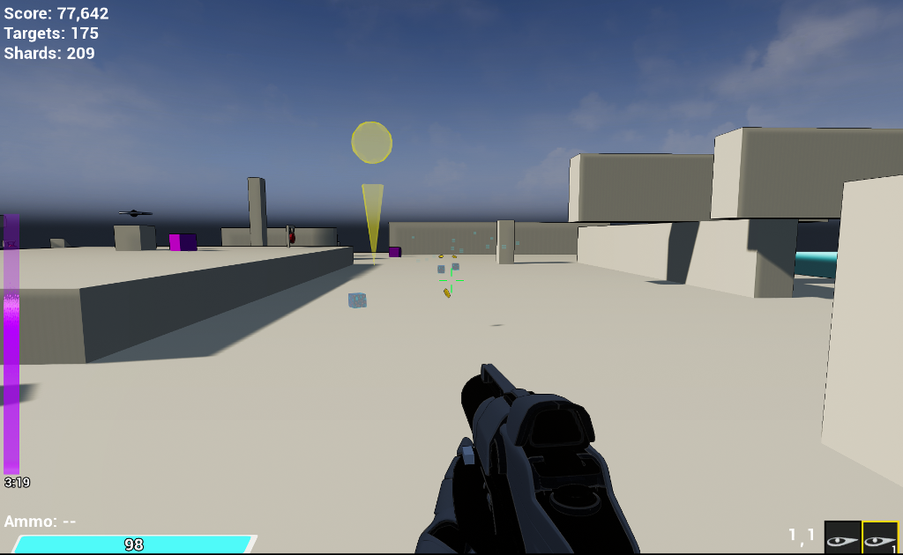

# TargetRunner
[Working title]

VR and First Person multiplayer target shooting. Written in c++ and Blueprint. Tested with HTC Vive.
UnrealEngine 4.26

## Narrative
You are an agent responsible for locating and eliminating anomalies in the cyberspace of an ancient system called The Ether. Each time you run through a subsystem you send a sliver of yourself into your avatar. This allows you to operate within the Ether. This sliver, your Animus, is the internal energy of a soul that makes you, “you” and separates you from the endless hive mind of The Ether in which you operate. 

You have a limited amount of Animus and it constantly dissipates into the Ether while you possess your avatar. You must navigate the platforms of the Ether and reach the exit sync before you run out of Animus while eliminating anomalies you encounter. If your Animus depletes, you will lose control of your avatar as the will of the Ether replaces your own.  

But you will have other avatars. And you will take endless runs through The Ether. That is what you are. That is why you are.  Isn’t it?

## Gameplay
Make your way through the platforms to collect the keys (gold and magenta columns). Use the keys to open the Exit Sync (green column) before your Animus drains away.

Each platform contains one or more Anomaly Ejectors. Each ejector must complete its cycle before neighboring platforms are unlocked. Shoot waiting Anomaly Ejectors and they will begin their cycle right away.

Standard WASD control in first-person mode.

Press 'F' or down on right motion controller d-pad to change weapon mods.  All mods are currently available: standard shot, bomb shot, rapid-fire and magnum.  Some weapon mods consume special ammo types.

## Study Project
This project is part of my learning process and serves to demonstrate familiarity with various concecpts including:
 - c++ actor components, data driven scene generation and pickup drops, grid manager actor, others.
 - Multiplayer concepts including session creation, replication, server level load transition
 - First-person and VR support in PlayerController and Pawn.
 - Data driven pickup goods
 - Goods inventory actor component (ammo and pickup inventory)
 - VR HUD rendered to HMD stereo layer

## TODO 
### Functionality
 - Complete multiplayer with a full online subsystem to allow unique client player identification
     - Proper save game for client players
 - Armory to allow spending earned goods (shards, etc.) to purchase ammo and unlock weapon mods between levels
 - Improve "End of Run" summary - include more of the available stats, goods, high scores, etc.
 - Upgrade (tree?) for long-term progression including movement rate, jump height, jump aerial control, max energy, max animus, weapon fire rate, damage, projectile speed, etc.
     - Upgrade via level unlock and redemption of collected goods.
 - Improved between level/lobby flow
 - More varieties of anomaly types (enemy targets)
 - Special target shooting objectives that reward the keys and other goods drops. (boss fights?)
 - GUI for High scores and improve tracking of high scores
 - Run Tracker: a visual representation of your journey through The Ether. A tally of successful runs for each level unlocked (1-100).
 - More shootable targets and clutter
 - Additional scenery meshes and scene templates
 - Game spash screen and home menu
 - Game options
 

### Needed Improvements
 - Improve enemy drone behavior
 - More sound assets
 - More FX and improve existing
 - Better UMG styling. i.e. any styling at all. :)

 

 

 

