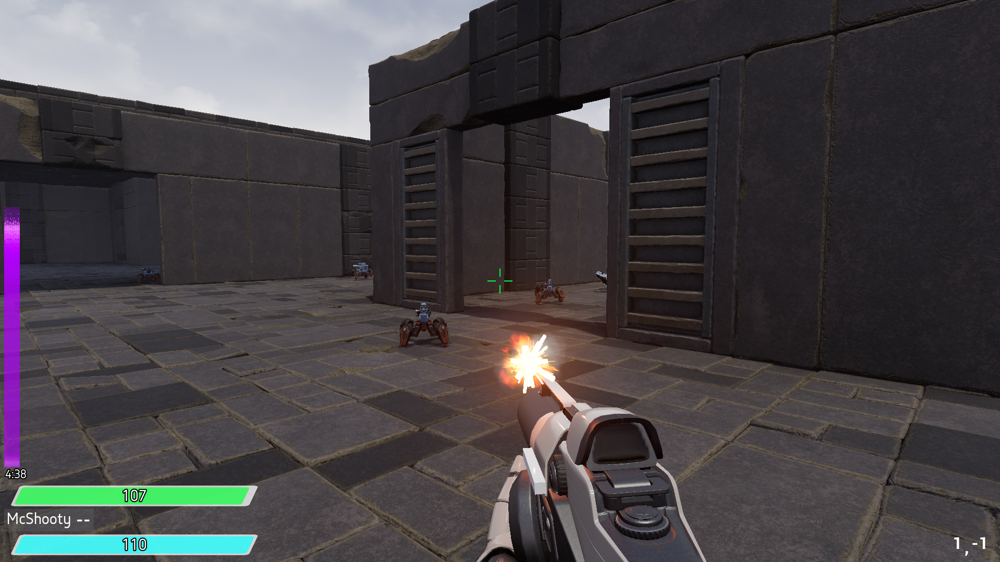
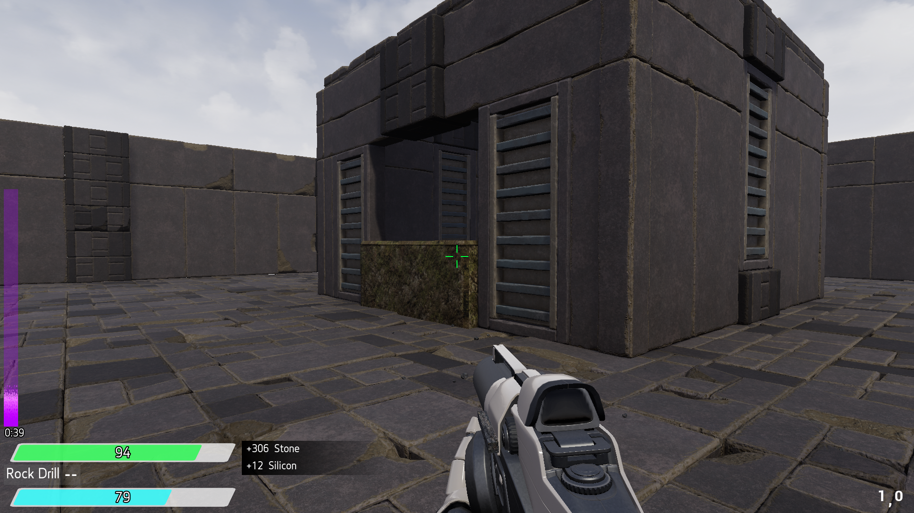
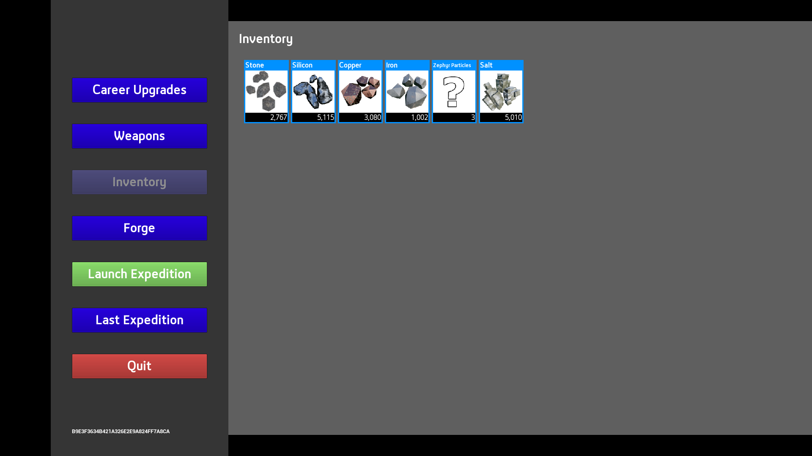
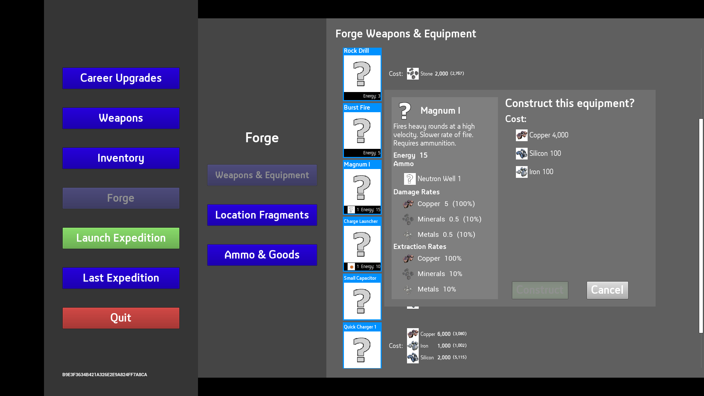
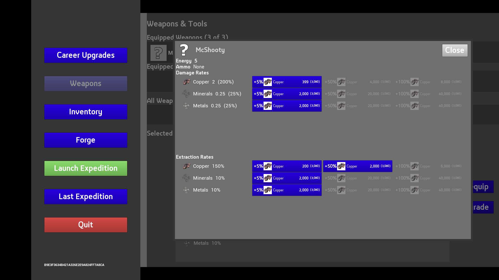

# TargetRunner

### My original VR version is [here](https://github.com/kbbits/TRVR).

First Person multiplayer target shooting, resource collecting and crafting. Written in c++ and Blueprint.
UnrealEngine 4.26

## Narrative
Reality has shattered. You exist in the timeless Ether. Fragments of worlds from different times and places still exist, scattered throughout the Ether.
By visiting these fragments you can collect materials from these slices of reality. With these materials you can hopefully reboot the universe. Each time you run through a frament you send a sliver of yourself. This allows you to exist in these fragments, outside of the Ether. This sliver, your Animus, is the internal energy of a soul that makes you “you” and separates you from the endless hive mind of The Ether in which you operate. 

You have a limited amount of Animus and it constantly dissipates back into the Ether while you explore reality fragments. You must navigate the fragments and reach an exit portal. Along the way you will collect resources and defeat the strange entities that occupy these fragments. If your Animus depletes, you will lose contact with the fragment and be drawn back to the Ether, leaving all of your collected resources behind.  

But you will take endless runs through the Ether. That is what you are. That is why you are -- to rebuild reality.

## Gameplay
Make your way through the procedurally generated levels to collect resources and locate the exit portal before your Animus drains away. Craft and upgrade weapons and equipment in your forge.

Standard WASD control in first-person mode. Q and E to cycle through equipped weapons. Spacebar to jump.

Weapons mods currently available: standard shot, bomb AOE shot, rapid-fire, magnum and a flare gun.  Some weapon mods consume special ammo types.

## Study Project
This project is part of my learning process and serves to demonstrate familiarity with various concepts including:
 - C++ actor components, data driven scene generation and pickup drops, grid manager actor, others.
 - Multiplayer concepts including session creation, server level load transition, replication of relevant actors/components/actions/anims.
   Currently supports connection via IP or LAN play.
 - Procedural level generation based on level templates supporting block set themes, resource tiers and difficulty levels. Underlying grid maze generation is configurable, current default is an implementation of Prim's
 - Instanced static meshes used for level geometry, managed through custom room component system.
 - Custom BP editor tool for creating room components used in level generation.
 - Data driven (drop table based) pickup items.
 - Goods inventory actor component (ammo and pickup inventory).
 - Instanced weapons/equipment, individually rename-able and upgradable. 
 - Resource type system affecting damage and extraction rates of weapons, based on resource type of the entity hit.

## TODO 
 - Assets for each weapon. (get rid of default gun mesh, etc.)
 - Thumbnails for all goods, weapons, etc.  (get rid of "?" placeholder thumb)
 - Additional, higher tier, resource types
 - More weapon types and re-balance upgrade progression
 - Extend career progression for long-term progression and include additional attributes: movement rate, jump height, jump aerial control
 - Improve lighting
 - More environment variety, deco and clutter 
 - Additional scenery meshes and scene template themes.
 - BGM for each template theme
 - Player character mesh for third-person view in multiplayer.
 - More varieties of enemies and special actors
 - Special objectives that reward special resource types. (boss fights?)
 - Homeworld: Change lobby level to act as player "base". Craftable parts to place around your base that unlock/improve gameplay elements. Move crafting/refining to these entities instead of via lobby menu.
 - Run Tracker: a visual representation of your journey through The Ether. A summary of successful runs for each location fragment.
 - More sound assets
 - More FX and improve existing
 - Better UMG styling. Much better :)

 

##Player Inventory
 

##Weapon / Tool Crafting
 

##Weapon / Tool Upgrade
 

